# KeepOrganizedAI

[](LICENSE)
[](https://chromewebstore.google.com/detail/keeporganizedai/ejcmcpeohpjbipdfhpmfohpdefgbdfpl)
[](https://chromewebstore.google.com/detail/keeporganizedai/ejcmcpeohpjbipdfhpmfohpdefgbdfpl)
[](https://github.com/abdelhadidevv/keeporganizedai-extension)
[](https://github.com/abdelhadidevv/keeporganizedai-extension)

AI-powered Chrome extension that automatically organizes your bookmarks through a 3 simple step wizard.

## Features

- **AI Categorization** - Uses Gemini, Claude, or OpenAI to analyze and categorize bookmarks
- **Folder Locking** - Hard Lock (protect entirely) or Smart Lock (preserve as category)
- **3-Step Wizard** - Lock folders → Generate categories → Apply organization
- **Automatic Backup** - Creates backup before any changes; download anytime
- **Global Search** - Find any bookmark instantly
- **Dark/Light Theme** - Follows your system preference



## Quick Start

```bash
npm install
npm run dev
```

Load the extension in Chrome:

1. Go to `chrome://extensions`
2. Enable **Developer mode**
3. Click **Load unpacked** → Select the `dist` folder

## AI Setup

Configure your API key in the Settings screen (click the gear icon).

## Scripts

| Command             | Description                      |
| ------------------- | -------------------------------- |
| `npm run dev`       | Development mode with hot reload |
| `npm run build`     | Production build                 |
| `npm run lint`      | Lint code                        |
| `npm run typecheck` | Type check                       |
| `npm test`          | Run tests                        |

## Tech Stack

React 19 · TypeScript · Vite · Tailwind CSS · Zustand · Radix UI

## Changelog

See [CHANGELOG.md](./CHANGELOG.md) for all notable changes.

## License

Licensed under the [GNU General Public License v3](./LICENSE).
